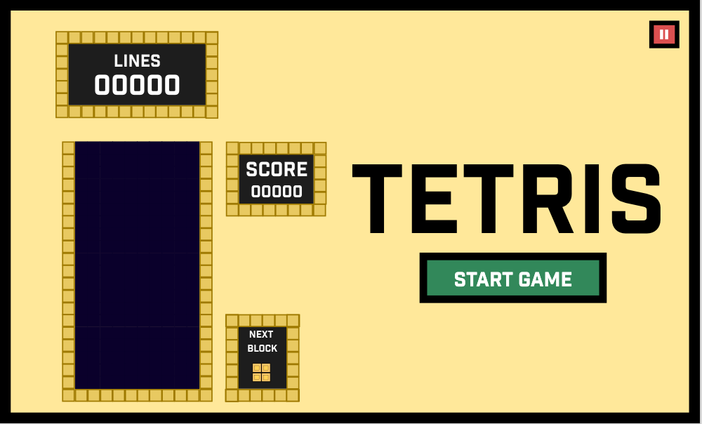
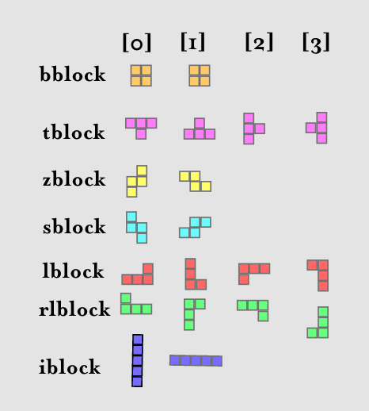

Tetris Project 1
Play it here: https://pages.git.generalassemb.ly/kemo99/ga-project-1/
# Concept Intro: Understanding Tetris

Brief:

- Project duration: 7 days
  ​​\* **Render a game in the browser**
- **Design logic for winning** & **visually display which player won**
- **Include separate HTML / CSS / JavaScript files**
- Stick with **KISS (Keep It Simple Stupid)** and **DRY (Don't Repeat Yourself)** principles
- Use **Javascript for **DOM manipulation\*\*
- **Deploy your game online**, where the rest of the world can access it
- Use **semantic markup** for HTML and CSS (adhere to best practices)

---

## Necessary Deliverables

- A **working game, built by you**, hosted somewhere on the internet
- A **link to your hosted working game** in the URL section of your Github repo
- A **git repository hosted on Github**, with a link to your hosted game, and frequent commits dating back to the very beginning of the project
- **A `readme.md` file** with explanations of the technologies used, the approach taken, installation instructions, unsolved problems, etc

## UI UX Design Idea:

Primary Features:

1. Line Score
2. Overall Score
3. Next Block Square
4. Game Square/grid
5. Tetris Logo + Start Game Button

## What is tetris:

Tetris is a W10 x H20 block grid, where shapes known as tetromino fall in random orders. The objective is to fill in a row of 10 grids with the shapes of the terominos by stacking, rotating and placing them smartly. When a row is filled it disappears making more room on the grid for more tetriminos. The game continues as rows are filled and points are scored. Eventually, due to uneven stacking, the tetriminos fill up the whole grid at which point the game is called and the score is returned. Challenging versions of the game may involve two potential mechanisms. The first involves decreasing the vertical space in the grid, the other by increasing the speed at which the tetrimons fall.

### What are the rules of tetris:

#### Piece creation:

1. Only one new piece can be at the board at any given time
2. The piece that is spawned is to be randomly selected from an array of possible tetromino configurations
3. The next piece is then displayed on a next screen piece

#### Piece movement:

4. The piece can move left, right and downwards to increase the speed of decent
5. The piece can not move through any of the outer boundaries
6. The piece can not move through any old pieces (filled spaces).

#### Row Clearing:

7. When a row is filled with 10 tetrimino parts, it is cleared, and the pieces drop down.
8. The score is then updated to match the result.
9. Multiple rows should be cleared at a time.

## Code Method:

1. Build a grid.
2. Generate block.
3. Allow the block to start dropping.
4. Move the block while it is dropping.
5. Keep the block moving as long as there is a empty block beneath it.
6. If a full row is filled with blocks then clear it and allow the blocks to continue dropping.
7. End game if the game over boundary is crossed.

### The Blocks:

These formats will be put into an array, which will change the value of the divs based on functions that
Create the blocks
The blocks will spawn in from the Origination boundary from a random position chosen by index that would not
Cause an overlap between the spawned piece and the wall blocks.
The type of block will be selected randomly from an array which contains a name of functions that produce the blocks
Only one block will fall at a time
When a block is created, it begins free falling at a rate of one block per second.
When the block contacts another block or wall it will stop moving downwards.
The next block will then spawn.

### Random Select block type

// create a variable for every block type in every configuration:

Const bblock1
Const bblock2

Const tblock1
Const tblock2
Const tblock3
Const tblock4

// create a variable for every block type with an array of the different
// variables as part of the array

Const bblock = [bblock1, bblock2]
Const tblock = [tblock1, tblock2, tblock3, tblock4]

// create an array out of the different block options so that the program can randomly select a block type and configuration to drop.

Const blockTypes = [bblock, tblock]

When selecting the block type to draw later, you can refer to them like this.

Const blockTypes = [bblock[bblock1, bblock2], tblock[tblock1, tblock2, tblock3, tblock4]]

To select;

blocktype[0][0]

Use Math.Random in order to randomly generate the numbers

tblock = [ 1, width + 1, width*2+1, -1]

### Making the block appear newBlock

Const startingPosition =4
// select a div from the div array using the
// random select block type method
// select a div from the div array through the
// index described in the block types properties
// along with the starting position property
// convert the class to the class block
// and the sub class with the block type
// go to the next property outlined in the
// block types properties next property and repeat.

### Moving blocks down:

Draw block at top
Undraw block at top
Draw block at position 2
Use a time based(interval) function to iterate
Through this until the block becomes a filled space
This happens when it touches a filled item.
Draw a new block()

To decide position 2, add a set amount of blocks to the
Const ‘starting position’

# Code Breakdown:

## Variables:

## Funcations:

### createGrid(gridCellCount, wrapper, array):

The createGrid() function takes three variables:

1. gridCellCount: This refers to the number of squares needed in the squares. In this case it was 200 for the main grid and 70 for the next piece grid.
2. wrapper: This specifies where in the document the grid should be produced. This is a div that will act as a wrapper for the grid contents.
3. array: As divs are added to form the grid, they are also inputted into an array so that they can be indexed and manipulated. The arrays they are inputted into are previously defined variables "cells" and "nextPieceCells".

The function uses a for loop to iterate through the code required to create a new grid. The number of iterations is determined by gridCellCount variable. The code also indexes the grid elements via ID.

### randomBlockSelector():

Random block selector function uses Math.Random method in order to generate a random value that will be used to randomly select a tetromino shape type to create out of the array with the tetromino choices "possibleBlocks".

This function is used across the code in order to select tetromino conformations for projection across the UI.

### drawBlock(currentBlock, currentPosition):

drawBlock is a local function called within the function newBlock(). This function is responsible for drawing the tetrimino at a designated position on the main grid.

The function takes two variables:
currentBlock: currentBlock is defined outside of this function by using the randomBlocksSlector() function to randomly select a tetromino formation for the drawBlock() function to draw.
currentPosition: currentPosition is the position which the tetromino renders from. It is defined outside of this function, usually in the newBlcok() function. The current position starts at index 4 on the grid. As the piece moves downwards, the width of the grid is added to the currentPosition so that the piece is rendered further down in the grid upon the next iteration.

an if statement is used in order to check which of the tetrimo classes to give to the div. This will allow for different coloured tetrominos to be made in the main.css document.

The code uses methods to manipulate objects in the array iteratively in order to update their class to that of a tetromino.

### convertToFilled(currentBlock, currentPosition):

convertToFilled is a local function called within the function newBlock(). This function is responsible for replacing the terimino div class with a filled div class to signal past tetrominos that had landed on the grid.
currentBlock and currentPosition variables are identical to those in the drawBlock() function and intended to work together.

### function deleteBlock(currentBlock, currentPosition):

deleteBlock is a local function called within the function newBlock(). This function is responsible for removing the tetromino classed divs from the board. This is used to give the illusion that the tetrimino is moving down the screen.
currentBlock and currentPosition variables are identical to those in the drawBlock() function and intended to work together. The function uses similar logic to that in the drawBlock function in order to delete the different tetromino types.

### newBlock():

### logID(e.code):

This function contains the logic required to deal with the keydown event listener. It responds to the arrow key presses by either moving the shape to the left, the right or downwards, or by rotating the shape when the up key is pressed. drawBlock() and removeBlock() functions are called to transpose the block. Conditional statements are used to prevent blocks from moving further left or right or downwards than the grid boundaries, or to cross filled spaces created by past tetrominos.

#### Challenge

There is still a bug in this function which is that it relies on the highestNumberInBlock function in order to prevent further movement to the left or the right. The Challenge with this is that some shapes have protrusions which occur before the bottom most shape, and in these cases shapes are still able to cross the game's boundaries. This must be fixed for a more seamless experience
.

### playGame():

This is the function that controls whether or not the game is going to commence. It is tied to the eventListener associated with the startGame button and will either display playing.. when the game is ongoing or gameover.. when the game is lost.

#### bug:

A current bug in the program is that it does not display gameOver when the round is lost.

### addScore():

The addScore functions Logic is programmed in order to recognize when a player has filled a full row with tetromino blocks. When that is the case the function acts on DOM elements to update the line score and the game score. The function is also responsible for clearing the completed row from the array, and adding more grid squares to the top of the array to give the appearance of more space being created, and existing pieces to continue falling downwards. Using the if function logic, the function also tracks every 10 lines cleared in order to add a wall obstacle at that bottom row of the page, thereby giving the player less space and making the game more difficult. The bug that needed to be fixed is to always make the new wall array appear from the bottom of the grid, rather than at the position of the cleared grid. This needs some changeups in the logic. The function is called at the end of each tetromino in order to check if the score needs to be updated.
The function uses a for statement to pan through the grid on a row by row basis.

### drawNextPiece():

This function is exactly the same as the drawBlock() function except the code is targeted to the nextPieceGrid in order to display the next piece.

### removeNextPiece():

This function is exactly the same as the removeBlock() function except the code is targeted to the nextPieceGrid in order to remove the currently displayed piece, before displaying the next.

### addEventListener 1:

The first event listener listens out for presses to the start game function in order to execute the playGame() function.

### addEventListener 2:

The event listeners are also used to register arrow keys onto the system, allowing us to move and rotate the piece around.

### Main Achievements:

The game was fully functional! With a start and game over button, it makes it easy for people to start. The game gets progressively more difficult, making it both fun and easy at starting rounds, and more challenging. I have personally spent a bunch of time playing it while developing it which has been distracting but lots of fun.

### Main Struggles:

Creating the pixel boundaries in the game board was complicated and took a lot of trial and error. I was surprised by the mathematical basis of the main functionality of this game. There are still some bugs with the piece spawning for certain tetrominoes which I need to get to the bottom of as it greatly decreases game quality.

### Things to note:

While the game is fully functional at lower levels, there are still bugs in the movement of the pieces, as well as the game boundaries with some of the tetromino shapes when rotated in certain directions. It needs to be modified by coming up with a new way to determine the position of all of the dots in the shape. This will require tweaking to the app which I am keen to get sorted. I have been considering coding this game in React with a multiplayer option for version two.

### Improvements I want to make:

Create a load screen for the game
Create two-player mode.
Recode the game in React
Create a panel to switch the CSS.  
Fix game bugs
